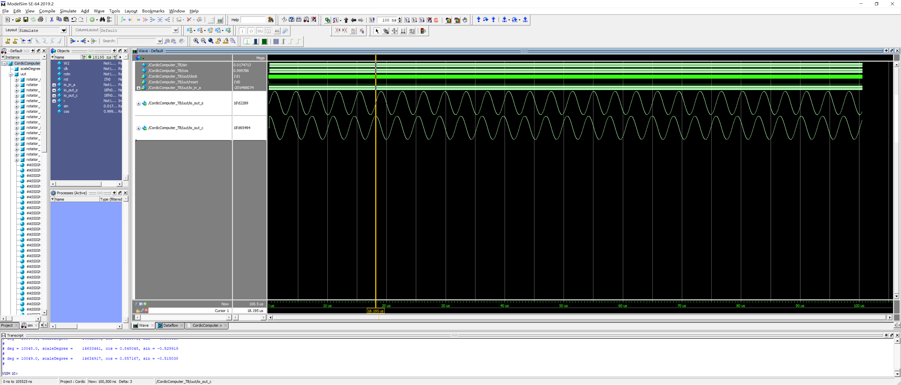

# Chisel Cordic Computer (Pipelined)

fixed-point precision, pipeline stages can be configured.

## How to use
1. Generate verilog code with the following parameters
   > W1: bit width of fixed-point numbers
   > I: bit width of integer part of fixed-point
   > F: bit width of fractional part of fixed-point
   > W2: bit width of angle, angle mapped [0, 45] to [0, 2^W2]
   > STAGE: total stages (iterations)
2. Feed the angle to be calculated. Note that the angle must be scaled between [0, 2^W2], and currently support degrees between [0, 45] only. The result will be valid after STAGE clock cycle.

## TODO
1. Add pipeline valid signal
2. Support other cordic calculations
3. ~~Support 0 ~ 360 degrees~~